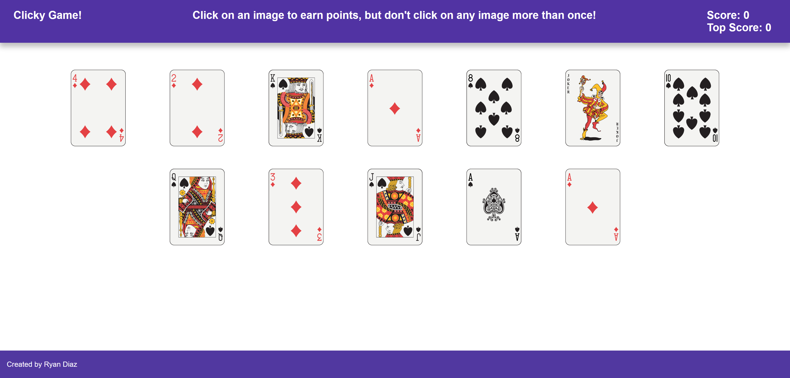

# Clicky Game
A memory game in which the user attempts to click a series of images without clicking any single image more than once.  Try to beat your top score. Get to 10 points to win!

While the game is simple in skill, the goal was to study DOM manipulation in React.

* Built using React, JavaScript, CSS Grid, Flexbox

* **For testing purposes, variables are logged in the Console**

Live Demo: [https://ryanadiaz.github.io/clickygame/](https://ryanadiaz.github.io/clickygame/)

